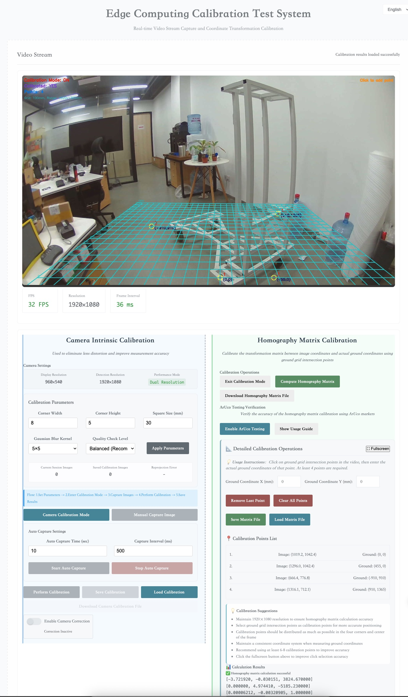

# VideoMapping - 视频流标定系统



## 📋 项目简介

VideoMapping是一个基于边缘计算的实时视频流标定系统，支持相机内参标定、单应性矩阵计算和ArUco标记验证。系统采用C++后端和Web前端架构，提供完整的中英文双语界面。

## ✨ 主要功能

### 🎥 实时视频流
- 高性能视频流传输（支持30FPS）
- 双分辨率显示优化
- 自适应帧率控制

### 📐 相机内参标定
- 棋盘格自动检测
- 批量图像采集
- 畸变校正参数计算
- 实时校正效果预览

### 🗺️ 单应性矩阵标定
- 图像坐标到地面坐标转换
- 交互式标定点选择
- 矩阵计算和验证
- 标定结果保存/加载

### 🎯 ArUco标记验证
- 实时ArUco标记检测
- 地面坐标计算验证
- 检测参数调节
- 精度验证报告

## 🚀 快速开始

### 环境要求
- Linux系统（推荐Ubuntu 20.04+）
- OpenCV 4.x
- CMake 3.10+
- C++17编译器

### 编译安装
```bash
# 克隆项目
git clone https://github.com/your-username/VideoMapping.git
cd VideoMapping

# 编译项目
mkdir build && cd build
cmake ..
make -j4

# 运行程序
./VideoMapping
```

### 使用方法
1. **启动系统**：运行程序后访问 `http://localhost:8080`
2. **相机标定**：
   - 设置棋盘格参数（默认9x6，方格25mm）
   - 进入标定模式，采集20-30张不同角度的图像
   - 执行标定并保存结果
3. **坐标转换标定**：
   - 进入标定模式，点击视频中的地面格子交叉点
   - 输入对应的实际地面坐标
   - 计算单应性矩阵并保存
4. **ArUco验证**：
   - 启用ArUco测试模式
   - 放置ArUco标记在已知位置
   - 观察计算坐标与实际位置的误差

## 🌐 多语言支持

系统支持中英文双语切换，所有界面元素和提示信息都已完成国际化。

## 📱 界面特性

- **响应式设计**：适配不同屏幕尺寸
- **实时状态显示**：FPS、分辨率、延迟监控
- **色盲友好**：优化的颜色方案，支持色盲用户
- **操作指导**：详细的使用说明和操作提示

## 🔧 技术架构

- **后端**：C++ + OpenCV + Crow框架
- **前端**：HTML5 + JavaScript + WebSocket
- **通信**：实时WebSocket双向通信
- **平台**：支持x86_64和ARM64架构

## 📊 性能特点

- **高帧率**：支持30FPS实时视频流
- **低延迟**：局域网环境下延迟<50ms
- **资源优化**：针对ARM64平台优化
- **稳定性**：完善的异常处理和错误恢复

## 🛠️ 开发状态

当前版本：**v2.10-aruco-internationalization-complete**

- ✅ 相机内参标定功能完整
- ✅ 单应性矩阵标定功能完整  
- ✅ ArUco标记检测和验证功能完整
- ✅ 完整的中英文国际化支持
- ✅ 色盲友好界面优化
- ✅ 性能优化和异常处理

## 📄 许可证

本项目采用MIT许可证，详见[LICENSE](LICENSE)文件。

## 🤝 贡献

欢迎提交Issue和Pull Request来改进项目。

## 📞 联系方式

如有问题或建议，请通过GitHub Issues联系我们。
